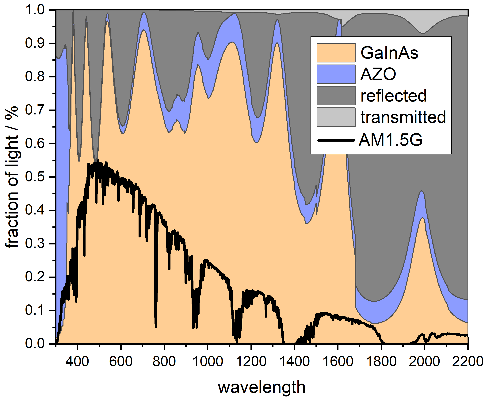
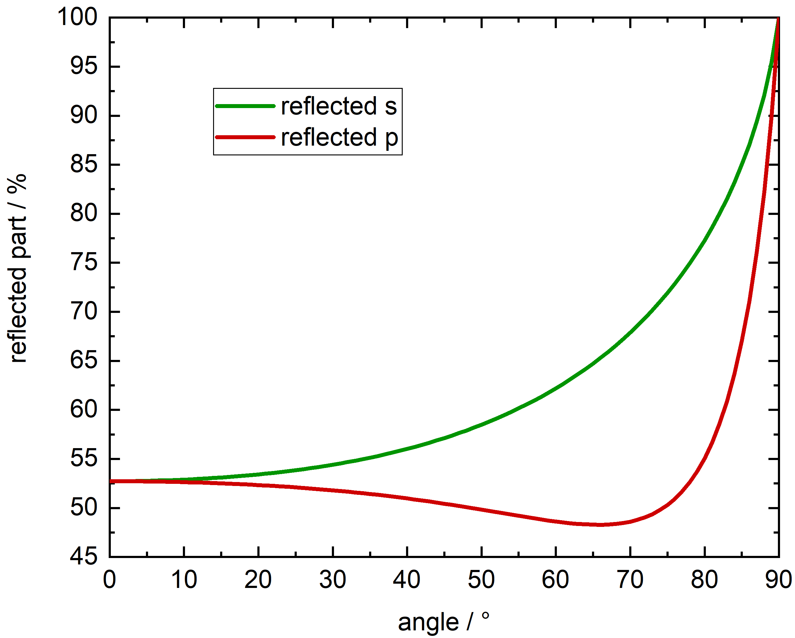
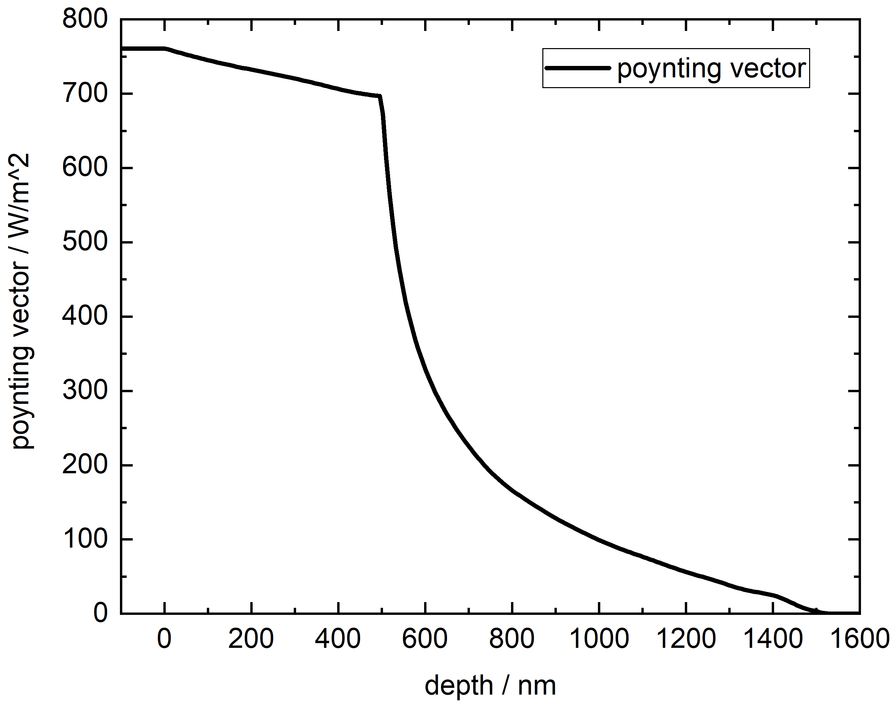

## Program to calculate a transfer-matrix approach

### Online Version
Available browser version <a href="http://pixel-95.weebly.com/transfer-matrix.html">here</a>.

### Calculations
Several optical data can be calculated with this program.

#### Fraction of absorbed light in each layer

#### AM1.5-weighted reflected power as a function of the angle of incidence

#### Poynting vector

### References
[1] S. J. Byrnes, Multilayer optical calculations, arXiv:1603.02720v4 [physics.comp-ph] (2019) 
[2] C. C. Katsidis and D. I. Siapkas, General transfer-matrix method for optical multilayer systems with coherent, partially coherent, and incoherent interference, Appl. Opt. 41, 3978-3987 (2002) 
[3] L. Taylor, Transfer-matrix Method Optical Calculator 
[4] Z. H. Mohammed, The Fresnel Coefficient of Thin Film Multilayer Using Transfer Matrix Method TMM, IOP Conf. Ser.: Mater. Sci. Eng. 518, 032026 (2019) 
[5] L. A. A. Pettersson et al, Modeling photocurrent action spectra of photovoltaic devices based on organic thin films, J. Appl. Phys. 86, 487 (1999) 
